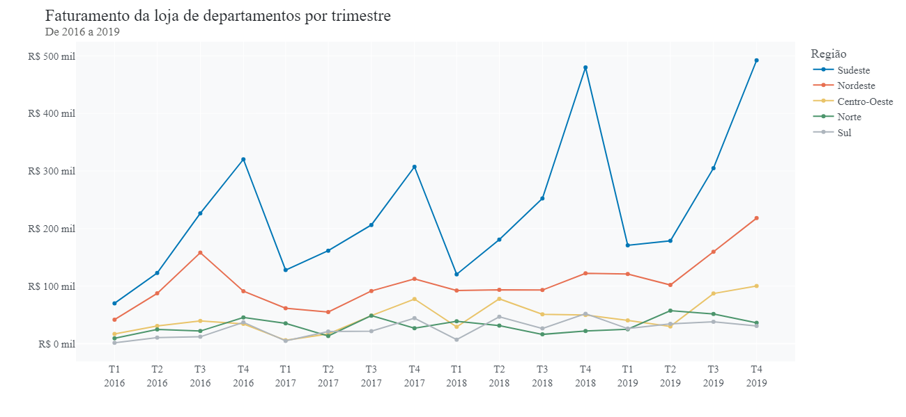
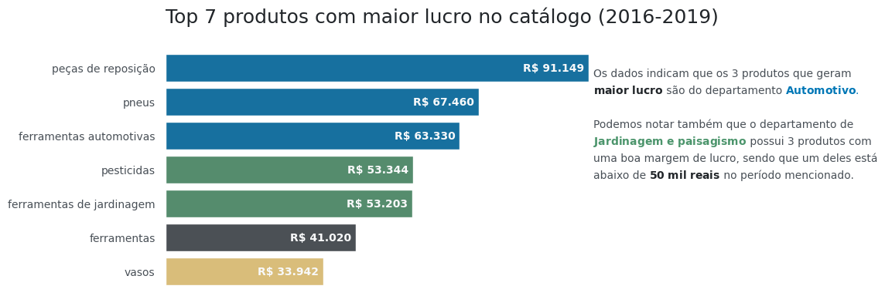

# Análise de Bases de uma Loja de Limpeza 🧼


Este projeto consiste na análise de três bases de dados de uma loja de produtos de limpeza. As bases de dados incluem medidas de sabão em pó, volume de amaciante e registros de vendas dos produtos. Cada base possui suas próprias características distintas, conforme descrito abaixo:

## Bases de Dados:

1. **Base de Medidas de Sabão em Pó:**
   - **Campos:** Comprimento, Altura, Largura, Amostra.

2. **Base de Volume de Amaciante:**
   - **Campos:** Volume.

3. **Base de Vendas de Produtos:**
   - **Campos:** Data do Pedido, Data de Envio, Modo de Envio, Nome do Cliente, Segmento do Cliente, Cidade, Estado, Região, Departamento, Tipo de Produto, Preço Base, Preço Unitário Sem Desconto, Desconto, Preço Unitário de Venda, Quantidade, Vendas, Lucro.

## Objetivo do Projeto:

O objetivo desta análise é extrair insights valiosos a partir das bases de dados fornecidas, visando entender padrões de compra, comportamentos dos clientes e otimizar estratégias de vendas e estoque.

### Exemplos de gráficos presentes no projeto:

### -- Análise de vendas por ano


### -- Análise de densidade dos produtos


### -- Análise de modo de envio


### -- Análise de vendas


### -- Top 7 produtos com o maior lucro


### -- Lucro por ano


## Estrutura do Repositório:

- **/data:** Contém os arquivos das bases de dados em formato CSV.
- **/notebooks:** Notebooks Jupyter contendo o código e as análises realizadas.
- **/results:** Resultados da análise, como visualizações gráficas e relatórios.

## Tecnologias Utilizadas:

- Python
- Pandas
- NumPy
- Matplotlib
- Seaborn

## Como Executar:

1. Clone este repositório:
   ```
   git clone https://github.com/seu-usuario/nome-do-repositorio.git
   ```
2. Instale as dependências:
   ```
   pip install -r requirements.txt
   ```
3. Execute os scripts ou notebooks na pasta `/notebooks`.


